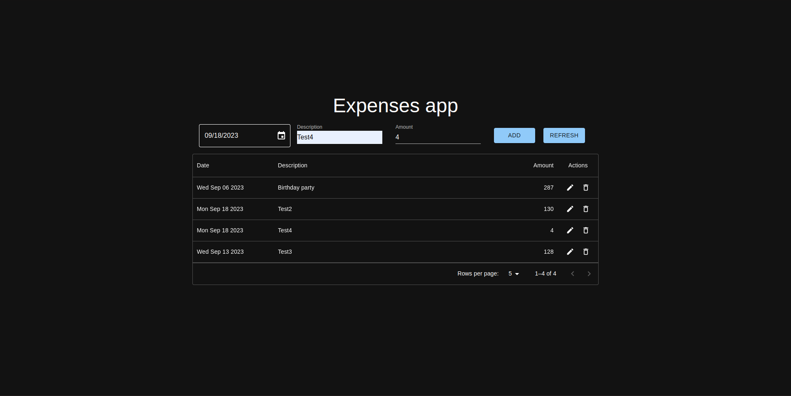

# Упражнение по Технология клиент сървър

## Валентин Свиленов Стоянов, фн206588, КН-Задочно

### Приложение за следене на разходите

Използвани технологии по задание: React и Firebase - Firestore Database
Допълнителни технологии: Material UI компоненти

Документация и обяснение - коментари в App.jsx

### Пускане на проекта

```
cd expenses-app
npm install
npm run dev // вместо npm start понеже проекта е инициализиран с vite, вместо create-react-app
```

### Screenshot



## React + Vite

This template provides a minimal setup to get React working in Vite with HMR and some ESLint rules.

Currently, two official plugins are available:

- [@vitejs/plugin-react](https://github.com/vitejs/vite-plugin-react/blob/main/packages/plugin-react/README.md) uses [Babel](https://babeljs.io/) for Fast Refresh
- [@vitejs/plugin-react-swc](https://github.com/vitejs/vite-plugin-react-swc) uses [SWC](https://swc.rs/) for Fast Refresh
